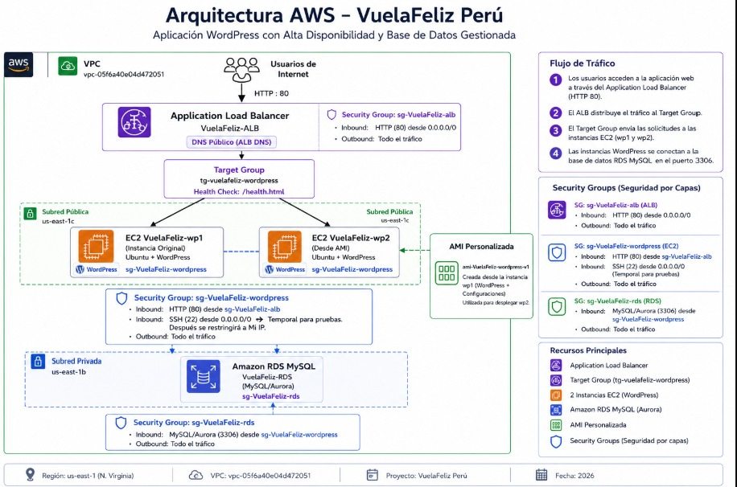
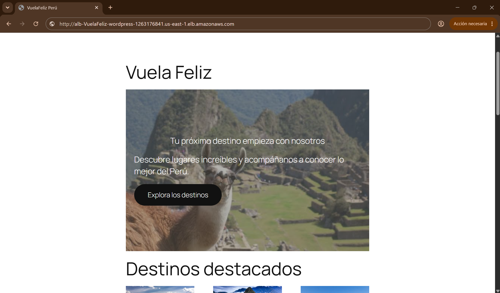
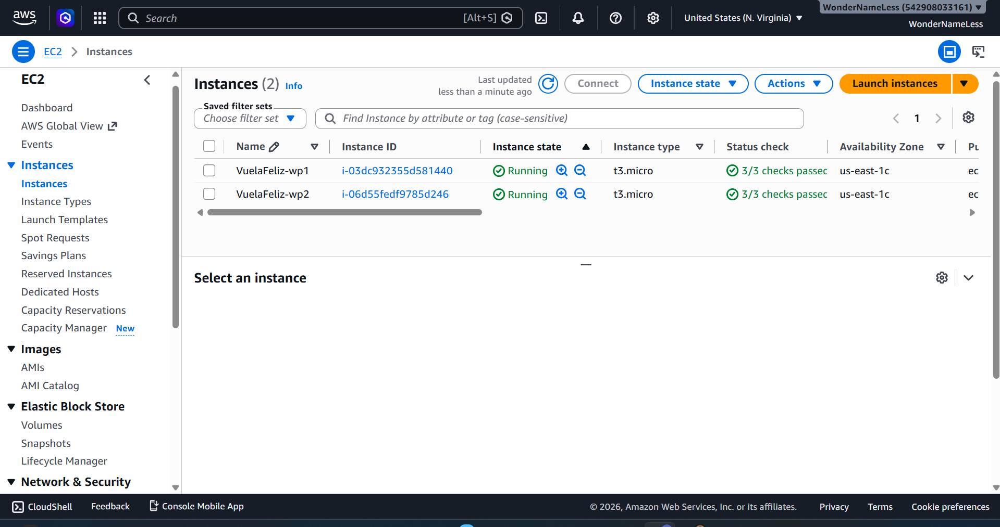
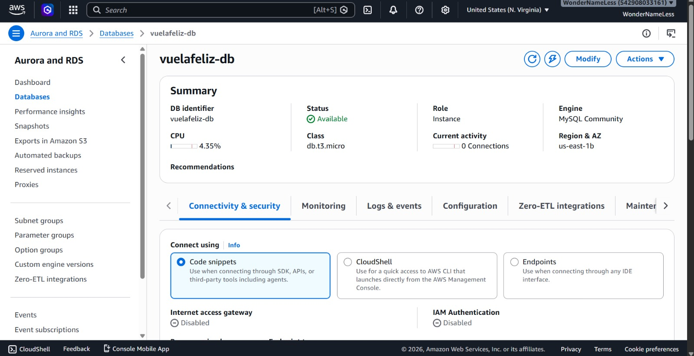
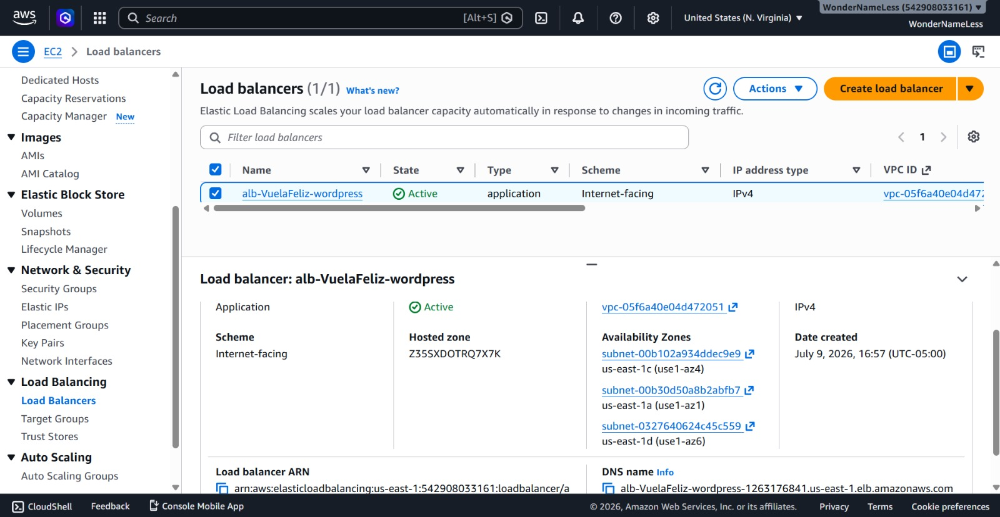
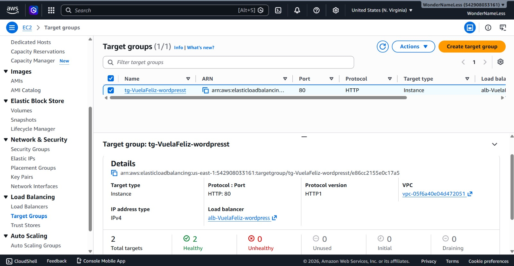

  # ✈️ VuelaFeliz Perú — Arquitectura Cloud en AWS

Proyecto académico de Cloud Computing enfocado en el diseño e implementación de una arquitectura web en AWS para una aerolínea ficticia llamada **VuelaFeliz Perú**.

El proyecto integra una aplicación web desarrollada con WordPress, dos instancias EC2, balanceo de carga, una base de datos MySQL centralizada en Amazon RDS y control de acceso mediante Security Groups.

## 🏗️ Arquitectura implementada



### Flujo de la arquitectura

```text
Usuarios de Internet
        │
        ▼
Application Load Balancer
        │
        ▼
Target Group
        │
        ├── EC2 VuelaFeliz-wp1
        │
        └── EC2 VuelaFeliz-wp2
                    │
                    ▼
            Amazon RDS MySQL
````
## ☁️ Servicios y tecnologías utilizadas

- Amazon EC2
- Application Load Balancer
- Target Groups
- Amazon RDS for MySQL
- Amazon Machine Image (AMI)
- Security Groups
- Ubuntu Server
- Apache
- PHP
- WordPress

## 🚀 Implementación

La solución utiliza dos instancias EC2 para la capa web. Ambas ejecutan Ubuntu Server con Apache, PHP y WordPress.

Se creó una AMI personalizada a partir de la primera instancia configurada para desplegar la segunda instancia con una configuración equivalente.

Las dos instancias están registradas en un Target Group y reciben tráfico mediante un Application Load Balancer.

Para la persistencia de datos se implementó Amazon RDS con MySQL como base de datos centralizada para WordPress.

## 🔐 Seguridad de red

La arquitectura utiliza Security Groups separados para las diferentes capas:

- El Application Load Balancer recibe tráfico HTTP público por el puerto 80.
- La capa WordPress recibe tráfico HTTP desde el Security Group del Load Balancer.
- Amazon RDS permite conexiones MySQL por el puerto 3306 desde el Security Group de la capa WordPress.

Esta separación permite controlar la comunicación entre las capas de la arquitectura.

## 📸 Evidencias

### Landing page de VuelaFeliz Perú



### Instancias EC2 en ejecución



### Amazon RDS MySQL



### Application Load Balancer



### Target Group con instancias saludables



## 🎥 Video de demostración

En este video se muestra la landing page funcionando y un recorrido por los principales componentes de la arquitectura implementada en AWS.

▶️ [Ver demostración completa del proyecto en YouTube](https://youtu.be/3qmkeu7qGfE)

## 🎯 Objetivo del proyecto

El objetivo fue aplicar de manera práctica conceptos de Cloud Computing mediante la implementación de una arquitectura web funcional en AWS.

Durante el desarrollo se trabajaron conceptos de:

- Cómputo en la nube con EC2.
- Distribución de tráfico mediante un Application Load Balancer.
- Verificación del estado de las instancias mediante Health Checks.
- Base de datos centralizada con Amazon RDS.
- Creación y uso de una AMI personalizada.
- Control de comunicación entre capas mediante Security Groups.

## 📌 Estado del proyecto

- ✅ Landing page responsive implementada en WordPress
- ✅ Dos instancias EC2 operativas
- ✅ Application Load Balancer activo
- ✅ Dos targets en estado Healthy
- ✅ Amazon RDS MySQL disponible
- ✅ AMI personalizada creada
- ✅ Security Groups separados por capa

## 👨‍💻 Autor

Proyecto desarrollado por **Jheremy German Lozano Espinal** como parte de mi formación en Ingeniería de Sistemas y mi preparación profesional en Cloud Computing y DevOps.
